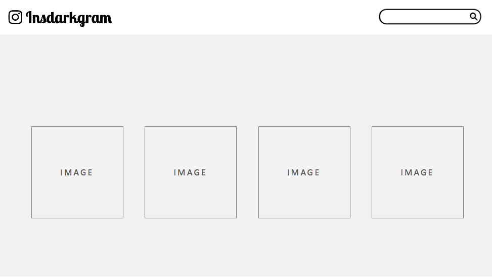
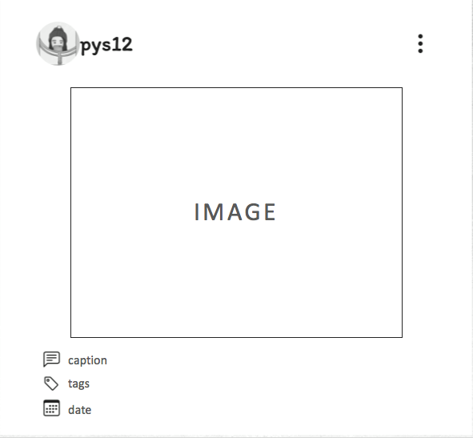

# Project2 
[Insdarkgram](https://insdarkgram.herokuapp.com/profile/)

## What is Insdarkgram?
An image sharing platform, allow users to create, view, edit, and delete posts. This application also included a search function allowing users to search posts by usernameg, captions, or tags.

## Wireframe:

## Technologies Used:
- HTML
- CSS
- JavaScript
- Bootstrap
- Express
- Mongodb Atlas
- Mongoose

## Final Look:

## Future Improvement:
- OAuth

